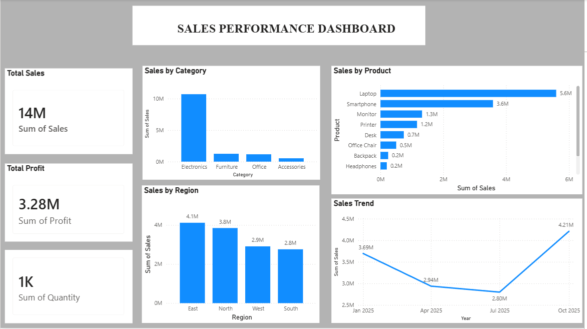
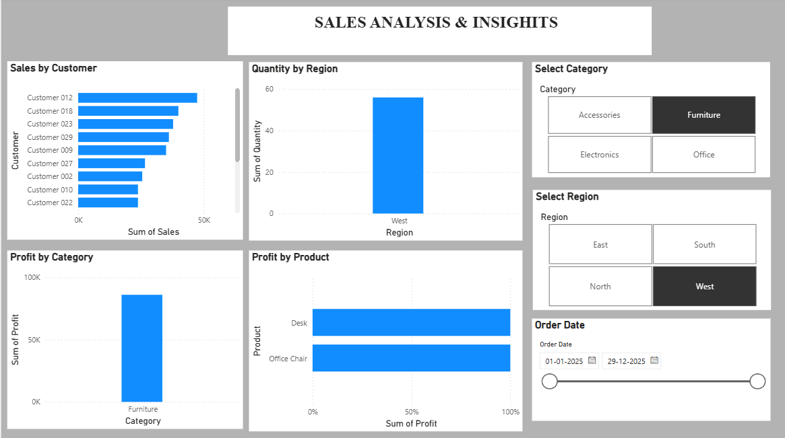

# Sales & Revenue Analysis Dashboard

An interactive Sales & Revenue Analysis Dashboard built using Microsoft Power BI and Excel.  
This project provides a clear view of sales performance, profit, product performance, customer analysis, and regional trends.

## 📊 Project Overview

The dashboard is designed to analyze sales data and provide meaningful business insights through interactive visualizations, KPIs, charts, and slicers.

## 🛠️ Tools & Technologies

- Microsoft Power BI
- Microsoft Excel
- Power Query
- Data Visualization
- Data Cleaning & Transformation

## 📈 Key KPIs

- Total Sales
- Total Profit
- Total Quantity
- Sales Trend

## 📊 Dashboard Features

### Page 1 – Sales Performance Dashboard

- Total Sales KPI
- Total Profit KPI
- Total Quantity KPI
- Sales by Category
- Sales by Product
- Sales by Region
- Sales Trend

### Page 2 – Sales Analysis & Insights

- Sales by Customer
- Quantity by Region
- Profit by Category
- Profit by Product
- Region Filter
- Category Filter
- Order Date Filter

## 🎯 Key Highlights

- Interactive dashboard with slicers and filters
- Sales and profit performance analysis
- Product and category-level analysis
- Regional performance comparison
- Customer-level sales analysis
- Time-based sales trend analysis

## 🖼️ Dashboard Preview

### Page 1 – Sales Performance Dashboard

### Page 2 – Sales Analysis & Insights

## 📂 Project Files

- `Sales_Performance_Dashboard.pbix` – Power BI dashboard file
- `Sales_Revenue_Dashboard_Data.xlsx` – Source dataset
- `Dashboard_Page1.png` – Dashboard Page 1 screenshot
- `Dashboard_Page2.png` – Dashboard Page 2 screenshot

## 🚀 How to Use

1. Download the `.pbix` file.
2. Open it using Microsoft Power BI Desktop.
3. Explore the dashboard pages.
4. Use the slicers to filter the data by region, category, and date.

## 👨‍💻 Author

**Oduri.Sai Charan**

B.Tech – Artificial Intelligence & Machine Learning
